# SpringBoot+Vue的金融投资管理平台

**有问题可以咨询企鹅Q1760272627** 

### 功能：
1、用户管理:
用户注册、登录、身份验证和权限管理。
用户信息管理 (个人资料、密码修改等)

2、投资产品管理
产品分类管理 (股票、债券、基金等)
产品信息管理 (名称、代码、价格、涨跌幅等) 。
产品购买、赎回等交易功能。

3、资产管理
账户管理(现金、股票、债券等)
资产配置和重平衡。
资产估值和盈亏统计。

4、交易管理:
下单、撤单、查询交易记录等功能。
交易费用计算与管理。

5、风险管理:
风险评估和分析。
风险警示与控制。

6、报表与统计:
账户资产报表
投资组合收益报表交易记录统计分析等

7、市场数据接口:
与金融市场数据接口对接，获取实时行情、历史数据等信息

8、消息推送与通知:
对投资者进行交易提醒、账户变动通知等消息推送
后端实现业务逻辑，前端负责页面展示

### 系统截图：
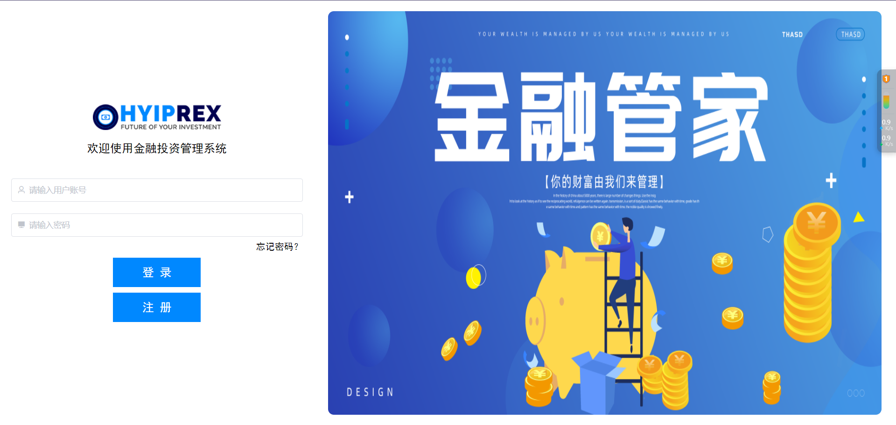

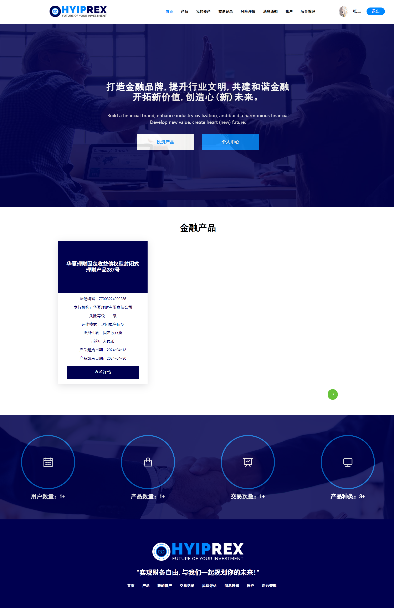
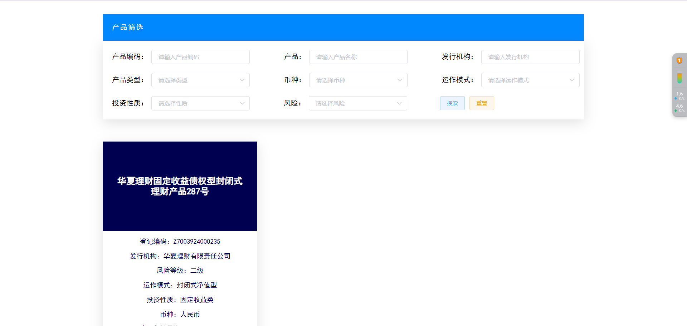
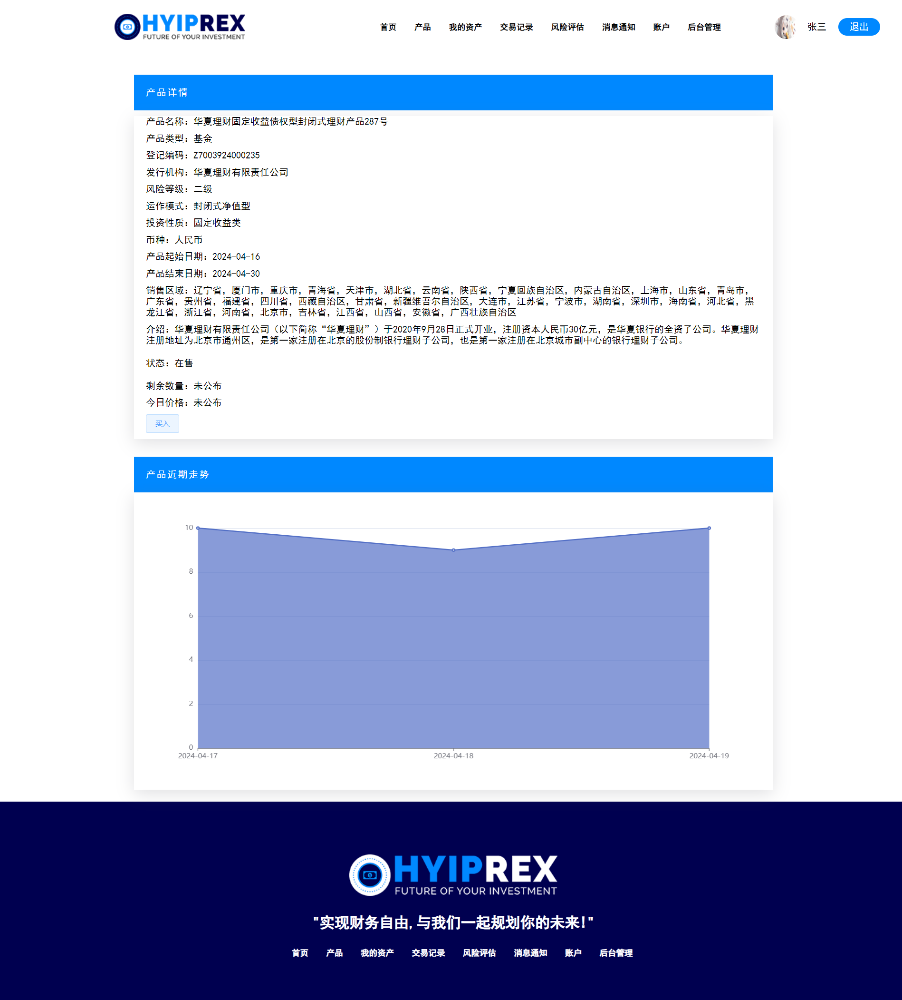
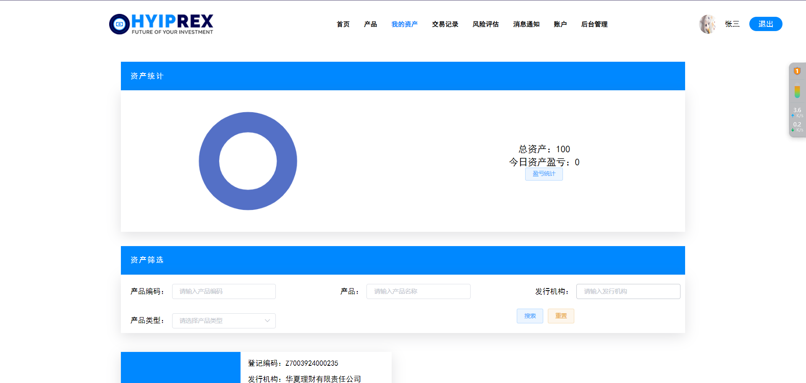
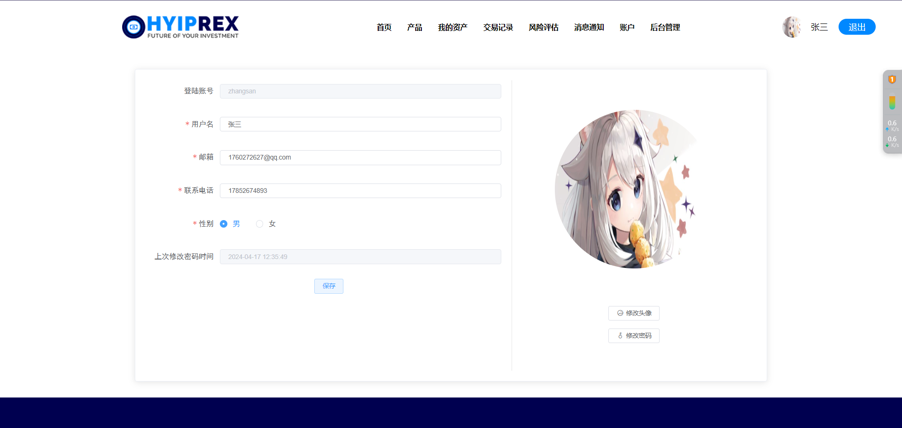
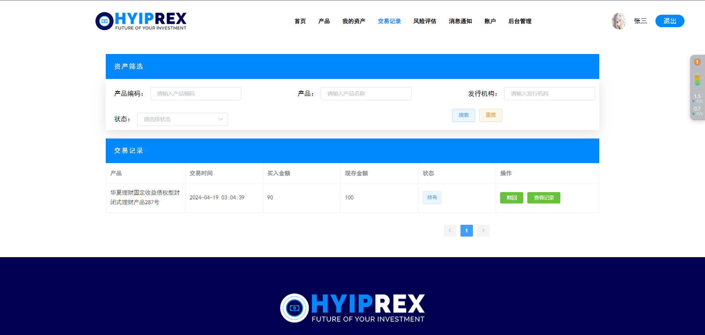
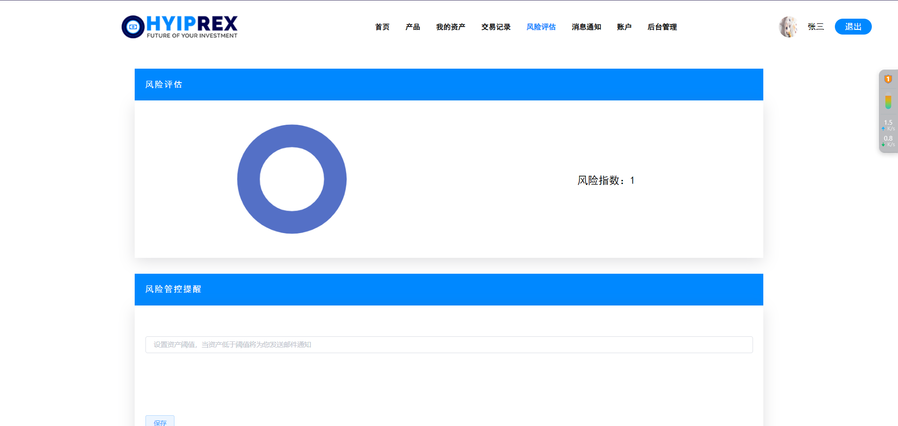
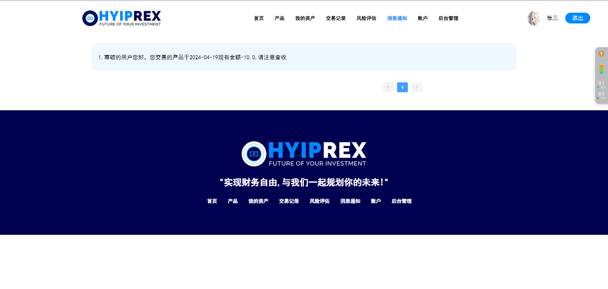
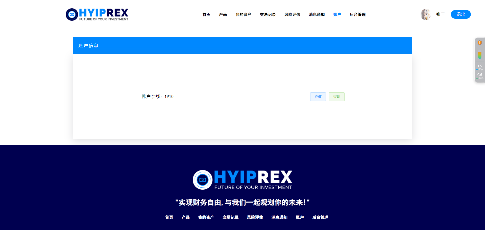
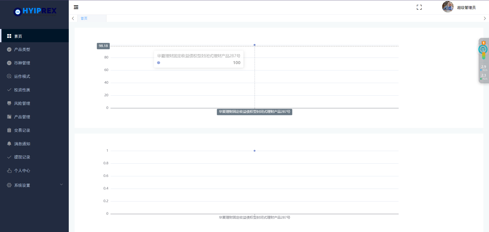

**有问题可以咨询企鹅Q1760272627** 